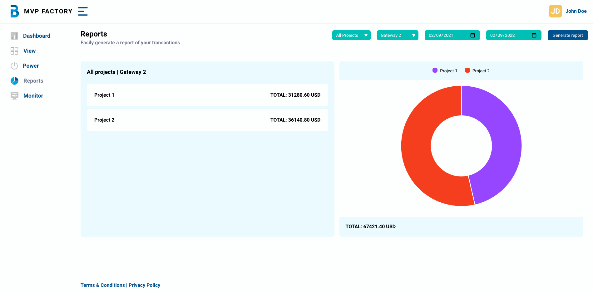

# MVP Factory Frontend Test #3

Simple, opinionated, **fully typed**, and **production-ready** project template for Vite.



[Demo View](http://mvpf-frontend-test-3.surge.sh/)

## Features

- `Vue 3.2`
- `Vite` for the frontend build tooling, instead of Vue Cli
- Using `Composition API` syntax(see the official [Script Setup documentation](https://v3.vuejs.org/api/composition-api.html))
- **Fully typed** [Vuex 4](https://next.vuex.vuejs.org/) store
- Routing using [vue-router 4](https://next.router.vuejs.org/)
- TypeScript 4.5
- Tailwind CSS 3.0 w/ following plugins preinstalled:
  - `@tailwindcss/aspect-ratio`
  - `@tailwindcss/line-clamp`
  - `@tailwindcss/typography`
  - `@tailwindcss/forms`
  - `firefox`-variant
- PostCSS 8 w/ `postcss-nesting` plugin
- `Eslint` and `Prettier` for code styling
- `Chart.js` for the data visualization
- `date-fns` date/time handling.
- Alias `@` to `<project_root>/src`
- Manually configured global components in `main.ts`
- // Cypress.io e2e tests (configured similarly to `vue-cli`)
- // Cypress.io component tests

---

To get started:

1. Clone the repository:

   ```bash
   git clone https://github.com/ironwebstar/MVP-Factory-Frontend-Test-3.git

   cd MVP-Factory-Frontend-Test-3
   ```

2. Install the dependencies:

   ```bash
   # Using npm
   npm install

   # Using Yarn
   yarn
   ```

3. Start the development server:

   ```bash
   # Using npm
   npm run dev

   # Using Yarn
   yarn dev
   ```

   Now you should be able to see the project running at localhost:3000.

4. Lint code using ESLint and Vue, Prettier, typescript configs

   ```bash
   # Using npm
   npm run lint
   npm run lint:fix

   # Using Yarn
   yarn lint
   yarn lint:fix
   ```

5. Open `src/*` and start experimenting!

## Building for production

To build an optimized version of your CSS, simply run:

```bash
# Using npm
npm run build

# Using Yarn
yarn build
```

After that's done, check out `dist` to see the optimized output.

---
